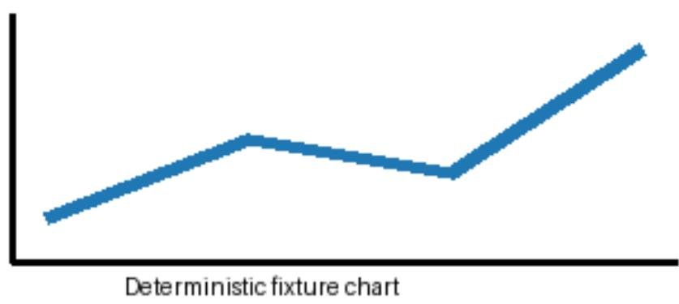

## DeepTutor LightRAG Bridge Fixture

A short paragraph preserves text and heading hierarchy.

$$
E = m c ^ { \wedge } 2
$$

Table 1. Retrieval engine paths
<table><tr><td>Engine</td><td>Path</td></tr><tr><td>LightRAG</td><td>Native</td></tr></table>

  
Figure 1. Synthetic trend chart.